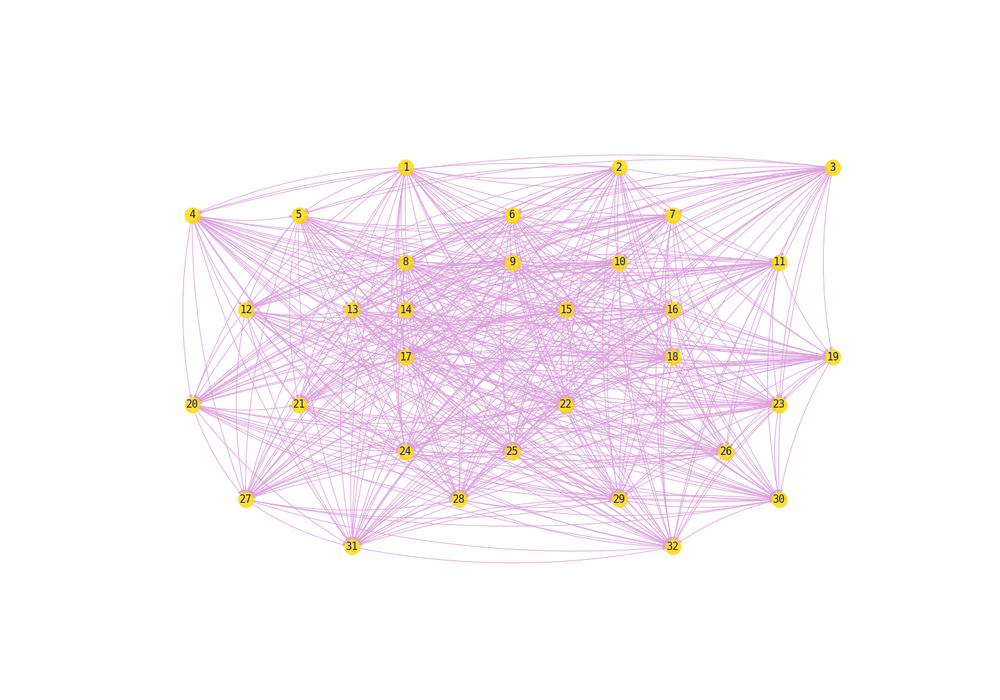
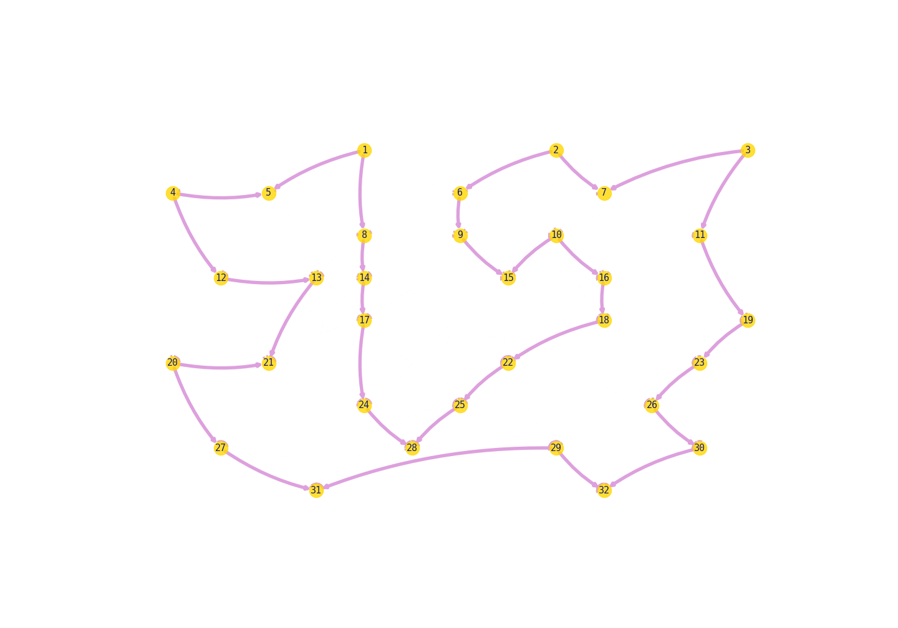

# Ant Colony Optimization for the Traveling Salesman Problem

This project implements an Ant Colony Optimization (ACO) algorithm to solve the Traveling Salesman Problem (TSP). ACO is a nature-inspired optimization algorithm that mimics the foraging behavior of ants to find an optimal or near-optimal path in a graph. In this case, it's applied to find the shortest path that visits a set of cities and returns to the starting city, the classic TSP.

# Features

Customizable parameters for the ACO algorithm, including the number of ants, evaporation rate, intensification factor, alpha, and beta.
Iterative optimization process with a stopping condition.
Visualization of the best path found using NetworkX and Matplotlib.

# Usage

Define your distance matrix (distance_matrix) representing the distances between cities.
Create an instance of the AntColony class, specifying the number of ants and other parameters.
Run the ACO algorithm using the find method, passing the distance matrix and other optional parameters.
Visualize the best path found using NetworkX and Matplotlib.

# Example usage:

    distances = distance_matrix(df.values, df.values)
    colony = AntColony(ants=len(distances), evaporation_rate=0.2, intensification=2, alpha=3, beta=2)
    colony.find(distances, iterations=300, k_max=300, random=True)

    '''
    Alpha (α): Increases the importance of the pherormones
    Beta (β): Increases the importance of the distances
    Evaporation: How much of the previous iteration is retained
    '''
# Visualizations

Here are visualizations showing the weight of pheromones in the first and last iterations:

Initial Pheromone Levels

Final Pheromone Levels

Acknowledgments

This project is inspired by the concept of Ant Colony Optimization seen in my artificial intelligence class and is implemented for educational and illustrative purposes.
